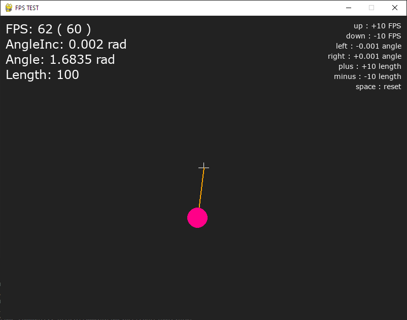

# Frame Rate Test in PyGame



## Run
```
py run.py
```

## Controls
- **Arrow UP** - increase FPS by 10
- **Arrow DOWN** - decrease FPS by 10
- **Arrow LEFT** - decrease angle increases by 0.001 rad
- **Arrow RIGHT** - increase angle increases by 0.001 rad
- **+/=** - increase radius by 10
- **-/_** - decrease radius by 10
- **SPACE** - reset settings
